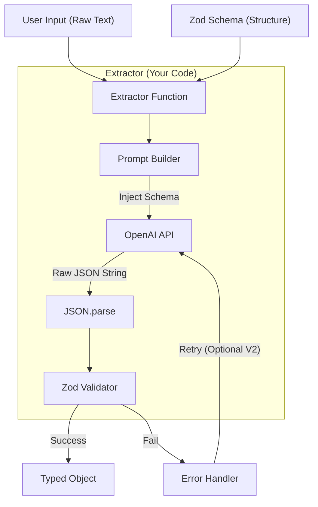

# Project 1: Structured Data Extractor - Design Document

> **Author**: Antigravity (Mentor)
> **Status**: Draft
> **Goal**: Build a production-ready utility to coerce LLM output into strict TypeScript types.

---

## 1. Context & Prerequisites (前置知识)

### 1.1 核心问题 (The Problem)
LLM 本质是一个“概率生成器”，它默认输出的是自然语言（String）。
但在工程中，我们需要的是 **Deterministic Data**（确定性的数据结构），比如 `JSON`。
如果 LLM 少写了一个 `}`，或者把 `age: 18` 写成了 `age: "eighteen"`，下游代码就会直接崩溃。

### 1.2 关键概念 (Key Concepts)

*   **Prompt Engineering regarding Schemas**:
    并不仅是告诉 AI "给我 JSON"，而是要把 TypeScript 接口定义转换成这 AI 能听懂的 Schema 描述放进 Prompt 里。
*   **Zod**:
    TypeScript 也就是编译时检查。运行时数据校验（Runtime Validation）必须靠 Zod 这样的库。
    *   *To Learn*: `z.object()`, `z.array()`, `z.infer<>`.
*   **JSON Mode vs Function Calling**:
    OpenAI 有两种方式强制输出结构化数据：
    1.  `response_format: { type: "json_object" }`: 强制输出 JSON，但结构还需要 Prompt 约束。
    2.  `tools` / `function_calling`: 专门用于让 AI 填参，非常精准。
    3.  `Structured Outputs` (New 2024): 严格模式。
    *   *Decision*: 本项目为了让你理解原理，我们会先采用 **Prompt + JSON Mode + Zod Validation** 的通用模式（兼容性最强，适用于所有模型），而不是直接依赖 OpenAI 的魔法。

---

## 2. Architecture (架构设计)

### 2.1 数据流 (Data Flow)



### 2.2 核心接口设计 (Interface)

在这个阶段，不要写 Class，写纯函数（Functional）。

```typescript
// 只需要暴露这一个核心函数
async function extractData<T>(
    text: string,
    schema: ZodSchema<T>
): Promise<T>
```

### 2.3 关键技术决策 (Trade-offs)

1.  **System Prompt 怎么写？**
    *   我们不应该每次手动写 Prompt。
    *   需要实现一个帮助函数 `zodToPrompt(schema)`，把 Zod 对象自动转成可读的文本描述，喂给 System Prompt。

2.  **错误处理策略**
    *   Level 1 (MVP): 如果 Zod 校验失败，直接抛出详细 Error（包含 Zod 的 error message），让开发者知道是 AI 傻了还是 Schema 没对上。
    *   Level 2 (Advanced): "Auto-Healing"。如果校验失败，把 Zod 报错喂回给 AI，让它重写一次。（本项目暂时只做 Level 1，Level 2 作为扩展作业）。

---

## 3. Implementation Plan (执行计划)

我们分三步走，每步验证一个核心能力。

### Step 1: 环境与基础调通
*   **Action**: `npm init`, 安装 `openai`, `zod`, `dotenv`, `typescript`。
*   **Goal**: 写一个 `index.ts`，能成功调用 OpenAI 并打印出 "Hello World"。

### Step 2: System Prompt 模板设计
*   **Action**: 编写 `func run(text, schemaDescription)`。
*   **Goal**: 手动把 Schema 写成 String 塞进去，验证 AI 能否返回合格的 JSON 字符串。

### Step 3: Zod 集成与泛型封装 (Final)
*   **Action**: 引入 Generic `<T>`, 实现 `extractData<T>`。
*   **Goal**:
    ```ts
    const UserSchema = z.object({ name: z.string(), age: z.number() });
    const result = await extractData("即刻大厂张三今年18岁", UserSchema);
    // result.age 应该是 number 类型，且编辑器有自动补全
    ```

---

## 4. Next Step For You

请确认以上设计是否清晰。如果没问题，我们将开始 **Step 1：环境搭建**。
