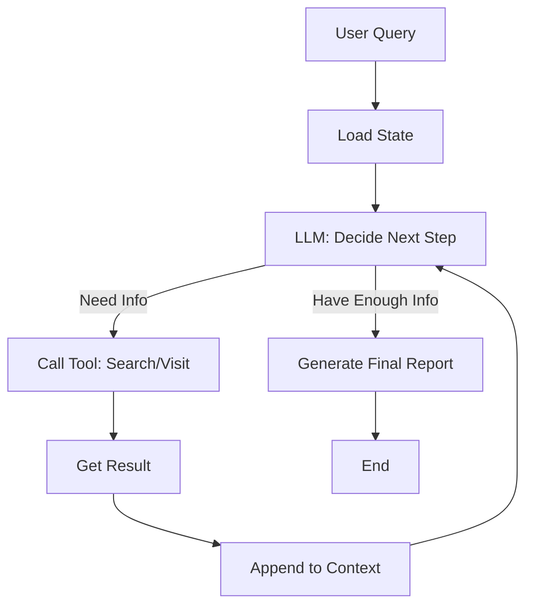

# Project 2: Deep Research Worker - Design Document

> **Goal**: Build a resilient, stateful worker that performs multi-step research tasks.

---

## 1. Context & Prerequisites

### 1.1 The "Context Window" Problem
Project 1 处理的是单次提取。Project 2 处理的是**“无限”信息**。
你不能把 100 个网页的内容一次性塞给 LLM。你需要：
1.  **分片 (Chunking)**：网页太长只取前 5000 字。
2.  **总结 (Summarization)**：把每个网页压缩成 200 字摘要。
3.  **汇总 (Synthesis)**：最后把摘要拼起来写报告。

### 1.2 Tool Use (Function Calling)
这是 Agent 的核心。
不是我们在代码里写死 `step1 -> step2`，而是把 Tools 暴露给 LLM，让 LLM 决定调用什么。
*   `search(query)`
*   `visit(url)`

---

## 2. Architecture: The "Loop"

最简单的 Agent 架构不是 DAG，而是一个 `While Loop`。



### 2.1 State Schema (State Machine)

我们需要一个 JSON 对象来持久化保存当前进度（方便崩溃重启）。

```typescript
type ResearchState = {
  goal: string;          // 用户原始问题
  plan: string[];        // LLM 生成的步骤 (e.g. ["Search react libs", "Visit github"])
  gathered_info: string[]; // 已经收集到的笔记
  visited_urls: string[];  // 防止重复抓取
  iteration: number;       // 防止死循环 (Max 10 loops)
}
```

---

## 3. Implementation Plan

### Phase 1: The Tools (Mocked First)
先实现两个 Tool 函数，暂时返回假数据，跑通流程。
*   `search_google(query)` -> returns JSON list of URLs
*   `read_webpage(url)` -> returns markdown text

### Phase 2: The Loop (ReAct Pattern)
实现核心循环：
1.  构造 Prompt 包含当前 State。
2.  调用 LLM 获取思考+行动。
3.  执行行动。
4.  更新 State。

### Phase 3: Real World (Optional Integration)
*   接入 `SerpAPI` (Google Search)
*   接入 `Puppeteer` / `Jina Reader` (Web Scraping)

---

## 4. Key Decision: Synchronous vs Asynchronous
为了简单，我们先做 **Synchronous Loop** (单线程阻塞式)。
但在生产环境，这通常是一个 Queue Worker (BullMQ)。

**Let's start with Phase 1.**
