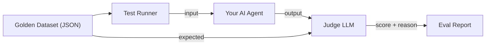

# Project 3: The Judge - 自动评估系统设计文档

> **Goal**: 建立一套可重复执行的自动化评估管线，用于验证 AI 输出质量。

---

## 1. Context & Prerequisites

### 1.1 为什么需要 Evals？

传统软件：`assert(output === expected)` → 通过/失败
AI 系统：输出是自然语言，无法精确匹配

**问题场景**：
你改了一个 Prompt，想知道效果是变好还是变差。
手动测试 5 个 Case？太主观，太慢。

**解决方案**：
1. 准备一个 **测试数据集**
2. 对每个样本运行 AI
3. 用另一个 LLM（Judge）给输出打分
4. 聚合得分，生成报告

### 1.2 关键概念

*   **Golden Dataset**: 一组带有"期望要点"的测试样本
*   **Candidate Output**: 待评估的 AI 输出
*   **Judge Prompt**: 指导评分 LLM 如何打分的 Prompt
*   **Rubric**: 评分标准（1-5 分各代表什么）

---

## 2. Architecture



### 2.1 数据结构

```typescript
// 测试样本
type EvalCase = {
    id: string;
    input: string;               // 输入给 Agent 的内容
    expected_points: string[];   // 期望输出应包含的要点
    category?: string;           // 可选：分类（用于分组统计）
};

// 评估结果
type EvalResult = {
    case_id: string;
    input: string;
    output: string;              // Agent 的实际输出
    score: number;               // 1-5 分
    reason: string;              // Judge 的评分理由
    latency_ms: number;          // 响应时间
};
```

### 2.2 Judge Prompt 设计

```
You are an AI Output Evaluator.

Given:
- User Input
- Expected Key Points
- Actual AI Output

Your task:
1. Check if the output covers the expected key points
2. Rate the output quality from 1 to 5:
   - 5: Excellent - covers all points, well-structured, insightful
   - 4: Good - covers most points, minor issues
   - 3: Acceptable - covers some points, noticeable gaps
   - 2: Poor - misses important points or contains errors
   - 1: Failed - irrelevant or harmful

Return JSON: { "score": number, "reason": string }
```

---

## 3. Implementation Plan

### Phase 1: 基础设施
*   创建项目骨架
*   定义类型 (`types.ts`)
*   准备 Golden Dataset (`data/cases.json`)

### Phase 2: Judge 实现
*   实现 `judge(input, expected, output)` 函数
*   返回 `{ score, reason }`

### Phase 3: Test Runner
*   实现 `runEval(dataset, agentFn)` 函数
*   并行执行 + 汇总结果

### Phase 4: 报告生成
*   输出 Markdown 报告（平均分、最差 Case、分布图）

---

## 4. 我们要评估什么？

作为练习，我们会评估 **Project 1 的 Structured Extractor**。

测试场景：给它不同风格的文本（正式/口语/混乱），检验它能否正确提取结构化数据。

---

## 5. Next Step

确认设计无误后，我们开始 Phase 1：初始化项目并准备测试数据集。
